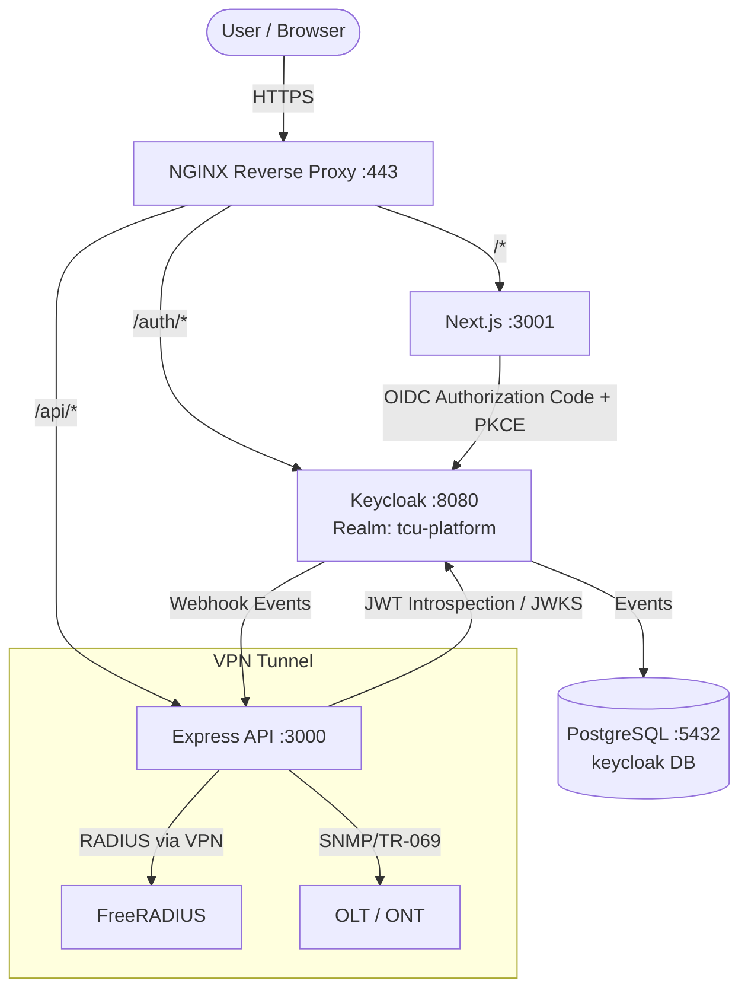

# Keycloak Design & Configuration
## TCU Platform — PT Top Class Universal

**Version**: 1.0  
**Author**: Security Architect  
**Date**: 2026-07-14  
**Keycloak Version**: 24.x (Quarkus distribution)

---

## 1. Architecture Overview



---

## 2. Realm Configuration

### 2.1 Realm: `tcu-platform`

| Parameter | Value |
|---|---|
| Realm Name | `tcu-platform` |
| Display Name | TCU Platform |
| Display Name HTML | `<strong>TCU Platform</strong>` |
| SSL Required | `external requests` (all external HTTPS) |
| Login with email | ✅ Enabled |
| Duplicate emails | ❌ Disabled |
| User registration | ❌ Disabled (admin-invite only) |
| Forgot password | ✅ Enabled |
| Remember me | ✅ Enabled |
| Verify email | ✅ Enabled |
| Login theme | `tcu-custom` (branded) |
| Account theme | `tcu-custom` |

### 2.2 Token Settings

| Parameter | Value |
|---|---|
| Access Token Lifespan | 300 seconds (5 min) |
| Access Token Lifespan (Implicit) | 900 seconds |
| Client Login Timeout | 300 seconds |
| Login Action Timeout | 1800 seconds |
| SSO Session Idle | 1800 seconds (30 min) |
| SSO Session Max | 43200 seconds (12 hrs) |
| Offline Session Idle | 2592000 seconds (30 days) |
| Refresh Token Max Reuse | 0 (rotation enabled) |

---

## 3. Realm Roles

```
tcu-platform Realm Roles:
├── superadmin
├── admin
├── noc_engineer
├── billing_manager
├── support_l1
├── support_l2
├── readonly_auditor
├── reseller
└── customer
```

### Composite Roles
```json
{
  "admin": {
    "composites": ["noc_engineer", "billing_manager", "support_l2"]
  },
  "support_l2": {
    "composites": ["support_l1"]
  },
  "reseller": {
    "composites": ["customer"]
  }
}
```

---

## 4. Clients

### 4.1 Client: `tcu-frontend`

| Parameter | Value |
|---|---|
| Client ID | `tcu-frontend` |
| Protocol | openid-connect |
| Access Type | public |
| Standard Flow | ✅ Enabled |
| Implicit Flow | ❌ Disabled |
| Direct Access Grants | ❌ Disabled |
| PKCE Method | S256 |
| Valid Redirect URIs | `https://topclass.id/*`, `http://localhost:3001/*` |
| Valid Post Logout URIs | `https://topclass.id/`, `http://localhost:3001/` |
| Web Origins | `https://topclass.id`, `http://localhost:3001` |

### 4.2 Client: `tcu-backend`

| Parameter | Value |
|---|---|
| Client ID | `tcu-backend` |
| Protocol | openid-connect |
| Access Type | confidential |
| Service Accounts Enabled | ✅ Enabled |
| Standard Flow | ❌ Disabled |
| Direct Access Grants | ❌ Disabled |
| Authentication | Client secret (rotated every 90 days) |
| Bearer Only | ✅ Enabled |

### 4.3 Client: `tcu-admin-cli`

| Parameter | Value |
|---|---|
| Client ID | `tcu-admin-cli` |
| Purpose | Internal service-to-service (user provisioning) |
| Access Type | confidential |
| Service Accounts Enabled | ✅ Enabled |
| Service Account Roles | `realm-management: manage-users, view-users` |

---

## 5. Client Scopes

### 5.1 Scope: `tcu-roles`
- **Mapper**: User Realm Role mapper
- **Token Claim Name**: `realm_access.roles`
- **Add to**: access token + ID token

### 5.2 Scope: `tcu-profile`
- **Mappers**:
  - `given_name`, `family_name`, `email`
  - Custom: `reseller_id` (User Attribute → `reseller_id`)
  - Custom: `tenant_id` (User Attribute → `tenant_id`)
  - Custom: `customer_id` (User Attribute → `customer_id`)

### 5.3 Protocol Mappers Configuration

```json
[
  {
    "name": "reseller_id",
    "protocol": "openid-connect",
    "protocolMapper": "oidc-usermodel-attribute-mapper",
    "config": {
      "user.attribute": "reseller_id",
      "claim.name": "reseller_id",
      "jsonType.label": "String",
      "access.token.claim": "true",
      "id.token.claim": "true"
    }
  },
  {
    "name": "tenant_id",
    "protocol": "openid-connect",
    "protocolMapper": "oidc-usermodel-attribute-mapper",
    "config": {
      "user.attribute": "tenant_id",
      "claim.name": "tenant_id",
      "jsonType.label": "String",
      "access.token.claim": "true",
      "id.token.claim": "false"
    }
  }
]
```

---

## 6. Authentication Flows

### 6.1 Browser Flow (Standard Users)
```
Browser Flow
├── Cookie (Alternative) → SUCCESS → proceed
├── Identity Provider Redirector (Alternative)
└── Forms (Alternative)
    ├── Username Password Form (Required)
    └── Conditional OTP
        ├── Condition - User Configured (Required)
        └── OTP Form (Required)
```

### 6.2 Browser Flow (Privileged Users: SUPERADMIN, ADMIN, NOC_ENGINEER)
```
Privileged Browser Flow
├── Cookie (Alternative) → SUCCESS → proceed
└── Forms (Alternative)
    ├── Username Password Form (Required)
    └── OTP Form (Required)  ← ALWAYS required, no condition
```

**Binding**: Override browser flow per-client for `tcu-frontend` for privileged roles using Keycloak's **Conditional Authenticator** that checks role membership.

### 6.3 Direct Grant Flow (API / Service Accounts)
```
Direct Grant
├── Direct Grant - Validate Username/Password (Required)
└── Conditional OTP (for non-service accounts)
```

---

## 7. Password Policy

| Policy | Value |
|---|---|
| Minimum length | 12 characters |
| Uppercase characters | At least 1 |
| Lowercase characters | At least 1 |
| Digits | At least 1 |
| Special characters | At least 1 |
| Not username | ✅ |
| Not email | ✅ |
| Password history | 10 previous passwords |
| Maximum auth failures | 5 (brute force detection) |
| Wait increment | 60 seconds |
| Max wait | 900 seconds |
| Failure reset time | 1200 seconds |

---

## 8. Identity Providers (Future)

| IDP | Protocol | Use Case |
|---|---|---|
| Google Workspace | OIDC | Staff SSO (topclass.id domain) |
| SAML 2.0 | SAML | Enterprise customer SSO |

> **Note**: IDP registration enforces email domain restriction to `@topclass.id` for Google Workspace.

---

## 9. Events & Audit

### 9.1 Admin Events
- ✅ Enable Admin Events
- ✅ Include Representation (payload)
- Retention: 90 days in Keycloak DB, then exported to S3-compatible storage

### 9.2 Login Events
| Event Type | Saved |
|---|---|
| LOGIN | ✅ |
| LOGIN_ERROR | ✅ |
| LOGOUT | ✅ |
| REGISTER | ✅ |
| UPDATE_PASSWORD | ✅ |
| TOKEN_EXCHANGE | ✅ |
| IDENTITY_PROVIDER_LINK | ✅ |

### 9.3 Event Webhook to TCU Audit Service
```javascript
// Keycloak → SPI Event Listener → POST to internal audit service
POST http://tcu-backend:3000/internal/keycloak-events
Authorization: Bearer <service-account-token>

{
  "type": "LOGIN",
  "realmId": "tcu-platform",
  "userId": "uuid",
  "ipAddress": "1.2.3.4",
  "time": 1720000000000,
  "details": { "username": "user@topclass.id" }
}
```

---

## 10. Docker Compose Deployment

```yaml
# docker-compose.keycloak.yml
version: "3.8"

services:
  keycloak:
    image: quay.io/keycloak/keycloak:24.0
    container_name: tcu-keycloak
    command: start --optimized
    environment:
      KC_DB: postgres
      KC_DB_URL: jdbc:postgresql://postgres:5432/keycloak
      KC_DB_USERNAME: keycloak
      KC_DB_PASSWORD: ${KC_DB_PASSWORD}
      KC_HOSTNAME: auth.topclass.id
      KC_HOSTNAME_STRICT: true
      KC_HTTP_ENABLED: true
      KC_PROXY: edge
      KEYCLOAK_ADMIN: admin
      KEYCLOAK_ADMIN_PASSWORD: ${KC_ADMIN_PASSWORD}
      KC_FEATURES: token-exchange,admin-fine-grained-authz
    ports:
      - "8080:8080"
    depends_on:
      - postgres
    networks:
      - tcu-internal
    restart: unless-stopped

  postgres:
    image: postgres:15-alpine
    container_name: tcu-keycloak-db
    environment:
      POSTGRES_DB: keycloak
      POSTGRES_USER: keycloak
      POSTGRES_PASSWORD: ${KC_DB_PASSWORD}
    volumes:
      - keycloak_pg_data:/var/lib/postgresql/data
    networks:
      - tcu-internal
    restart: unless-stopped

volumes:
  keycloak_pg_data:

networks:
  tcu-internal:
    external: true
```

---

## 11. Express.js Integration

```typescript
// middleware/auth.ts
import { expressjwt } from 'express-jwt';
import jwksRsa from 'jwks-rsa';

const KEYCLOAK_REALM_URL =
  process.env.KEYCLOAK_URL + '/realms/tcu-platform';

export const authenticate = expressjwt({
  secret: jwksRsa.expressJwtSecret({
    jwksUri: `${KEYCLOAK_REALM_URL}/protocol/openid-connect/certs`,
    cache: true,
    rateLimit: true,
  }),
  audience: 'tcu-backend',
  issuer: KEYCLOAK_REALM_URL,
  algorithms: ['RS256'],
});

// Permission checker middleware
export function requirePermission(resource: string, action: string) {
  return (req: any, res: any, next: any) => {
    const roles: string[] = req.auth?.realm_access?.roles ?? [];
    const allowed = PERMISSION_REGISTRY[resource]?.[action] ?? [];
    if (roles.some((r) => allowed.includes(r))) return next();
    res.status(403).json({ error: 'Forbidden', resource, action });
  };
}
```

---

## 12. NGINX Route Protection

```nginx
# /etc/nginx/conf.d/tcu-platform.conf

location /auth/ {
    proxy_pass          http://keycloak:8080/;
    proxy_set_header    Host              $host;
    proxy_set_header    X-Real-IP         $remote_addr;
    proxy_set_header    X-Forwarded-For   $proxy_add_x_forwarded_for;
    proxy_set_header    X-Forwarded-Proto $scheme;
    proxy_buffer_size   128k;
    proxy_buffers       4 256k;
}

location /api/ {
    # JWT validation happens in Express middleware
    proxy_pass          http://localhost:3000/;
    proxy_set_header    Authorization    $http_authorization;
    proxy_set_header    X-Real-IP        $remote_addr;
}
```

---

## 13. Realm Export & IaC

Keycloak realm configuration is exported as JSON and committed to the infrastructure repository:
```
infrastructure/
├── keycloak/
│   ├── tcu-platform-realm.json   ← Realm export (no secrets)
│   ├── themes/tcu-custom/        ← Custom login theme
│   └── docker-compose.keycloak.yml
```

Secrets are managed via **environment variables** and **Docker Secrets**, never committed to git.
