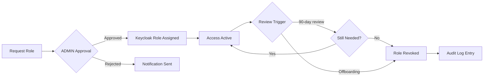

# Role-Based Access Control (RBAC) Design
## TCU Platform — PT Top Class Universal

**Version**: 1.0  
**Author**: Security Architect  
**Date**: 2026-07-14  
**Classification**: Internal — Confidential

---

## 1. Overview

TCU Platform adopts a **hierarchical RBAC** model enforced at three layers:

| Layer | Enforcement Point | Technology |
|---|---|---|
| Identity & AuthN | Keycloak IdP | OAuth2 / OIDC |
| AuthZ Gateway | API Gateway (NGINX + Express middleware) | JWT claim inspection |
| Data Row-Level | Prisma + PostgreSQL RLS | Row-Level Security policies |

All roles are defined in Keycloak **Realm Roles** and mapped to fine-grained **permissions** via composite roles and client scopes.

---

## 2. Role Taxonomy

### 2.1 Platform-Level Roles (Realm Roles)

```
SUPERADMIN
 └── ADMIN
      ├── NOC_ENGINEER
      ├── BILLING_MANAGER
      ├── SUPPORT_L1
      ├── SUPPORT_L2
      ├── READONLY_AUDITOR
      └── RESELLER
           └── CUSTOMER
```

### 2.2 Role Definitions

| Role | Description | Trust Level |
|---|---|---|
| `SUPERADMIN` | Full platform control, including IAM and system config | Critical |
| `ADMIN` | Manage users, services, pricing; no IAM changes | High |
| `NOC_ENGINEER` | Network ops: Mikrotik (via VPN), OLT, GenieACS, SNMP | High |
| `BILLING_MANAGER` | Invoices, payments, revenue reports, dunning | Medium-High |
| `SUPPORT_L1` | Read-only tickets, basic customer info lookup | Medium |
| `SUPPORT_L2` | Escalated tickets, PPPoE session management, resets | Medium |
| `READONLY_AUDITOR` | Read-only access to all logs and audit trails | Medium |
| `RESELLER` | Manage own sub-customers within allocated quota | Low-Medium |
| `CUSTOMER` | Self-service portal: invoices, usage, profile | Low |

---

## 3. Permission Catalogue

### 3.1 Resource Groups

| Resource Group | Resources |
|---|---|
| `iam` | users, roles, groups, sessions |
| `network` | devices, olt, pppoe-sessions, ip-pools, vpn |
| `billing` | invoices, payments, packages, promo-codes |
| `support` | tickets, comments, attachments |
| `reports` | revenue, traffic, sla |
| `audit` | logs, events, exports |
| `system` | config, backups, maintenance |
| `customer` | profile, services, documents |

### 3.2 Permission Verbs

| Verb | Meaning |
|---|---|
| `create` | POST — create new resource |
| `read` | GET — read resource(s) |
| `update` | PATCH/PUT — modify resource |
| `delete` | DELETE — soft/hard delete |
| `export` | Bulk data export |
| `approve` | Approve pending actions |
| `impersonate` | Act on behalf of another user |
| `execute` | Trigger operational actions (e.g., reboot OLT port) |

---

## 4. Role-Permission Mapping (Summary)

> See **Permission Matrix** document for full detail.

| Role | IAM | Network | Billing | Support | Reports | Audit | System |
|---|---|---|---|---|---|---|---|
| `SUPERADMIN` | CRUD+impersonate | CRUD+execute | CRUD+approve | CRUD | CRUD+export | CRUD+export | CRUD |
| `ADMIN` | CRUD (no impersonate) | Read+execute | CRUD+approve | CRUD | Read+export | Read | Read |
| `NOC_ENGINEER` | Read | CRUD+execute | Read | Read | Read | Read | — |
| `BILLING_MANAGER` | Read | Read | CRUD+approve | Read | CRUD+export | Read | — |
| `SUPPORT_L1` | — | Read (sessions only) | Read (invoices) | Read+create | — | — | — |
| `SUPPORT_L2` | — | Read+execute (PPPoE) | Read | CRUD | Read | — | — |
| `READONLY_AUDITOR` | Read | Read | Read | Read | Read+export | Read+export | Read |
| `RESELLER` | Read (own scope) | Read (own scope) | CRUD (own scope) | Read | Read (own scope) | — | — |
| `CUSTOMER` | Read (self) | — | Read (self) | Create+read (self) | — | — | — |

---

## 5. Scope Isolation

### 5.1 Tenant Scoping
- All resources carry a `tenant_id` / `reseller_id` foreign key.
- Prisma middleware automatically injects `WHERE tenant_id = :ctx_tenant_id` for non-SUPERADMIN roles.
- SUPERADMIN and ADMIN can pass `?tenant=<id>` to switch scope.

### 5.2 Row-Level Security (PostgreSQL)
```sql
-- Enable RLS on customer-sensitive tables
ALTER TABLE customers ENABLE ROW LEVEL SECURITY;
ALTER TABLE invoices ENABLE ROW LEVEL SECURITY;
ALTER TABLE pppoe_sessions ENABLE ROW LEVEL SECURITY;

-- Policy example: Reseller sees only own customers
CREATE POLICY reseller_isolation ON customers
  USING (reseller_id = current_setting('app.current_reseller_id')::uuid);
```

---

## 6. Session & Token Policy

| Parameter | Value |
|---|---|
| Access Token TTL | 5 minutes |
| Refresh Token TTL | 8 hours (sliding) |
| Idle Session Timeout | 30 minutes |
| Absolute Session Timeout | 12 hours |
| Token Algorithm | RS256 (2048-bit RSA) |
| MFA Requirement | SUPERADMIN, ADMIN, NOC_ENGINEER (mandatory) |
| MFA Method | TOTP (Google Authenticator / Authy) |

---

## 7. Least Privilege Enforcement

1. **Default Deny** — All API routes require an authenticated JWT; unauthenticated requests return `401`.
2. **Explicit Allow** — Permission middleware checks JWT `realm_access.roles` and `resource_access` claims against a policy registry.
3. **No Wildcard Grants** — Composite roles are built from named permissions, never from `*`.
4. **Temporary Elevation** — SUPPORT_L2 can request time-boxed `NOC_ENGINEER` elevation via approval workflow (ADMIN approval required); logged and auto-revoked after 2 hours.

---

## 8. Role Lifecycle



---

## 9. Compliance References

| Standard | Requirement |
|---|---|
| ISO 27001:2022 | A.5.15 — Access control |
| OWASP ASVS v4 | L2: 4.1.1 – 4.3.3 |
| GDPR Art. 32 | Appropriate technical measures |
| Indonesian PDP Law | Pasal 35 — Keamanan data pribadi |
